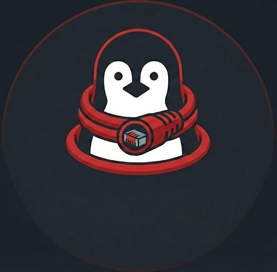

# VoidTunnel

<p align="center">
  
</p>

<p align="center">
  <strong>A powerful VPN/Proxy client for Linux</strong>
</p>

<p align="center">
  
  
  
  
</p>

---

## ✨ Features

- 🔌 **Multiple Protocols**: VMess, VLESS, Trojan, Shadowsocks, SSH
- 📋 **Profile Management**: Import/export via URL, subscription support
- 🛠️ **Payload Editor**: HTTP header injection for bypassing restrictions
- 🌐 **System Proxy**: Auto-configure GNOME/KDE system proxy
- 📊 **Real-time Stats**: Upload/download speed, total data usage
- 📝 **Connection Logs**: Real-time colored log viewer
- 🎨 **Modern UI**: Dark theme with PyQt6

## 📸 Screenshots

*Coming soon*

## 🚀 Installation

### Prerequisites

- Python 3.10 or higher
- Linux (Ubuntu, Fedora, Arch, etc.)
- PyQt6

### Quick Start

```bash
# Clone the repository
git clone https://github.com/klsdfernando/VoidTunnel.git
cd VoidTunnel

# Create virtual environment
python -m venv venv
source venv/bin/activate

# Install dependencies
pip install -r requirements.txt

# Run the application
python src/main.py
```

On first run, VoidTunnel will prompt you to download Xray-core automatically.

## 📖 Usage

### Adding Servers

1. Go to **Servers** tab
2. Click **+ Add** or **📥 Import**
3. Paste your server URL:
   - `vmess://...`
   - `vless://...`
   - `trojan://...`
   - `ss://...` (Shadowsocks)

### Subscription Import

1. Go to **Servers** → **📥 Import**
2. Enter your subscription URL
3. Click **Import**

### Payload Editor

Access the **Payload** tab to configure HTTP header injection:
- Set HTTP method and path
- Add custom headers
- Enable/disable per profile

## 📁 Configuration

Settings are stored in: `~/.config/voidtunnel/`

| File | Description |
|------|-------------|
| `settings.json` | Application preferences |
| `profiles/` | Server profile database |
| `config.json` | Current Xray configuration |

## 🔧 Supported Protocols

| Protocol | Status | Description |
|----------|--------|-------------|
| VMess | ✅ Full | V2Ray protocol |
| VLESS | ✅ Full | Lightweight V2Ray |
| Trojan | ✅ Full | TLS-based protocol |
| Shadowsocks | ✅ Full | Proxy protocol |
| SSH | 🔄 Basic | SSH tunneling |

## 🛠️ Tech Stack

- **Language**: Python 3.10+
- **GUI**: PyQt6
- **Core Engine**: Xray-core
- **Networking**: requests, psutil

## 📝 License

This project is licensed under the MIT License - see the [LICENSE](LICENSE) file for details.

## 👨‍💻 Author

**klsdfernando**

- GitHub: [@klsdfernando](https://github.com/klsdfernando)

## 🙏 Acknowledgments

- [Xray-core](https://github.com/XTLS/Xray-core) - The core proxy engine
- [PyQt6](https://www.riverbankcomputing.com/software/pyqt/) - GUI framework

---

<p align="center">
  Made with ❤️ by klsdfernando
</p>
